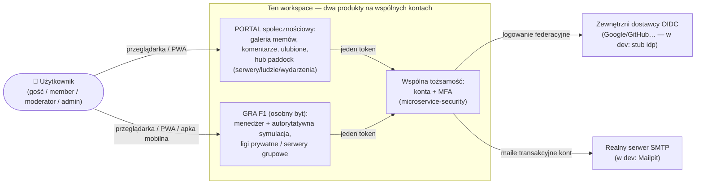
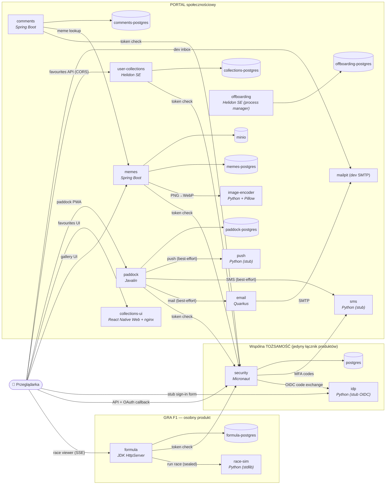
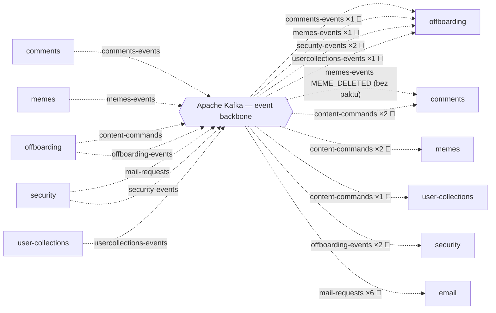

# Architektura — diagramy C4 (generowane)

> **NIE EDYTUJ RĘCZNIE.** Wygenerowane przez `./build_c4.py` z dwóch źródeł prawdy:
> `docker-compose.yml` (topologia runtime: krawędzie HTTP, magazyny, kto siedzi na Kafce)
> i commitowanych paktów `*/pacts*/*.json` (kierunek i semantyka zdarzeń, kontrakty HTTP).
> Zmienił się stack → odpal `python3 build_c4.py` i diagramy nadążą same.

## C1 — kontekst systemu

**Dwa produkty, nie jeden** (werdykt właściciela 2026-07-11): portal społecznościowy i gra F1 to osobne byty. Dzielą wyłącznie TOŻSAMOŚĆ (wspólne konto + MFA) i ten dev-compose; gra nie ma ani jednej krawędzi do memów/komentarzy/Kafki, a produkcyjnie wyjeżdża osobno (hosting/ per liga).

## C2 — kontenery: krawędzie synchroniczne (HTTP) i magazyny

Krawędzie serwis→serwis wyprowadzone ze zmiennych środowiskowych w `docker-compose.yml`;
etykieta = intencja wywołania. **Granica produktów jest inwariantem generatora**: jedyne
krawędzie wychodzące z GRY prowadzą do wspólnej tożsamości — gdyby kiedyś powstała krawędź
gra↔portal, `build_c4.py` przerwie z błędem zamiast ją narysować. Obserwowalność
(Prometheus/Grafana/Loki/Promtail/Tempo) celowo zwinięta — widzi wszystkie kontenery,
na diagramie byłaby spaghetti.

Uwagi nie do wyprowadzenia z env-ów (kuratorowane w skrypcie): krawędzie przeglądarki —
UI wypiekają adresy API w buildzie; `race-sim` nie ma portu na hosta (rozmawia z nim tylko
formula); collections-ui woła security i user-collections **cross-origin** (CORS).
Kanały powiadomień (email/sms/push) mieszkają po stronie portalu; tożsamość sięga do nich
przez granicę (kody MFA, maile kont) — patrz ADR 0005.

## C2 — kontenery: szyna zdarzeń (Kafka)

Kierunki przepływów pochodzą z **paktów message** (producer = provider paktu) — tego
`docker-compose.yml` nie wie (env mówi tylko „siedzi na Kafce”). 📜 = krawędź przypięta
kontraktem, ×N = liczba kształtów wiadomości w pakcie.

(Serwis może stać po obu stronach szyny — offboarding konsumuje fakt i potwierdzenia,
a produkuje komendy i werdykty — dlatego występuje po lewej i po prawej.)

Na Kafce siedzą (env `KAFKA_BOOTSTRAP_SERVERS`): comments, email, memes, offboarding, security, user-collections. **Gra F1 nie ma tu ani
jednej krawędzi** — szyna zdarzeń należy do portalu i tożsamości (osobne produkty;
generator pilnuje tego twardo).

## Pokrycie kontraktami (Pact)

| Konsument | Producent/Provider | Rodzaj | Interakcje | Plik paktu |
|---|---|---|---|---|
| comments | offboarding | message | a purge user content command; a purge user content command with an explicit policy | `microservice-comments/pacts/microservice-comments-microservice-offboarding.json` |
| email | security | message | a password reset mail request; a verification mail request; an account deleted mail request; an account deletion failed mail request; an already-registered notice mail request; an auth code mail request | `microservice-email/pacts/microservice-email-microservice-security.json` |
| memes | security | http | GET /me (×2) | `microservice-memes/pacts-http/microservice-memes-microservice-security.json` |
| memes | offboarding | message | a purge user content command; a purge user content command with an explicit policy | `microservice-memes/pacts/microservice-memes-microservice-offboarding.json` |
| offboarding | comments | message | a user content purged confirmation | `microservice-offboarding/pacts/microservice-offboarding-microservice-comments.json` |
| offboarding | memes | message | a user content purged confirmation | `microservice-offboarding/pacts/microservice-offboarding-microservice-memes.json` |
| offboarding | security | message | an account deletion requested fact; an account deletion requested fact with policy choices | `microservice-offboarding/pacts/microservice-offboarding-microservice-security.json` |
| offboarding | user-collections | message | a user content purged confirmation | `microservice-offboarding/pacts/microservice-offboarding-microservice-user-collections.json` |
| security | offboarding | message | a portal content purged announcement; a portal purge failed announcement | `microservice-security/pacts/microservice-security-microservice-offboarding.json` |
| user-collections | offboarding | message | a purge user content command | `microservice-user-collections/pacts/microservice-user-collections-microservice-offboarding.json` |
| offline-jwt | security | http | GET /.well-known/jwks.json | `offline-jwt/pacts/offline-jwt-microservice-security.json` |

Luki widoczne z tej tabeli (stan wygenerowania): paddock (fan-out email/sms/push),
formula↔race-sim i memes→image-encoder nie mają paktów — krawędzie na diagramach pochodzą
wtedy wyłącznie z compose; kaskada `MEME_DELETED` jest oznaczona „bez paktu”.

---
*Wygenerowano skryptem `build_c4.py`. C1 i wpisy „kuratorowane” są zaszyte w skrypcie —*
*zmieniasz je tam, nie tutaj.*
