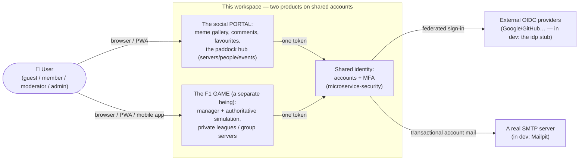
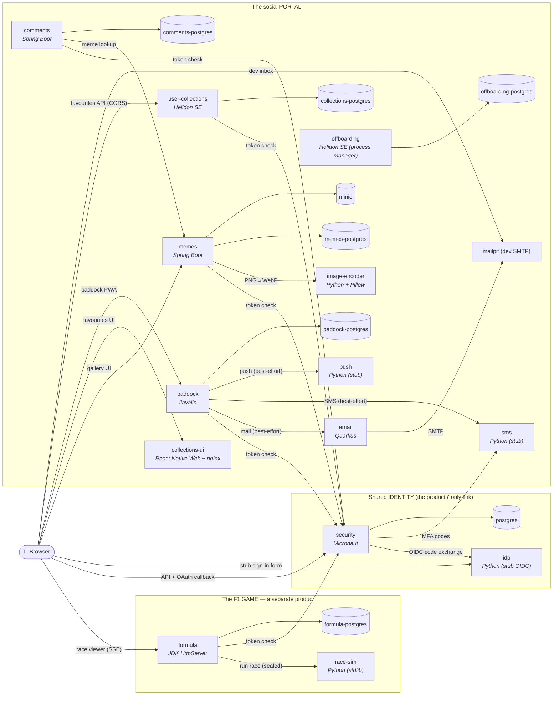
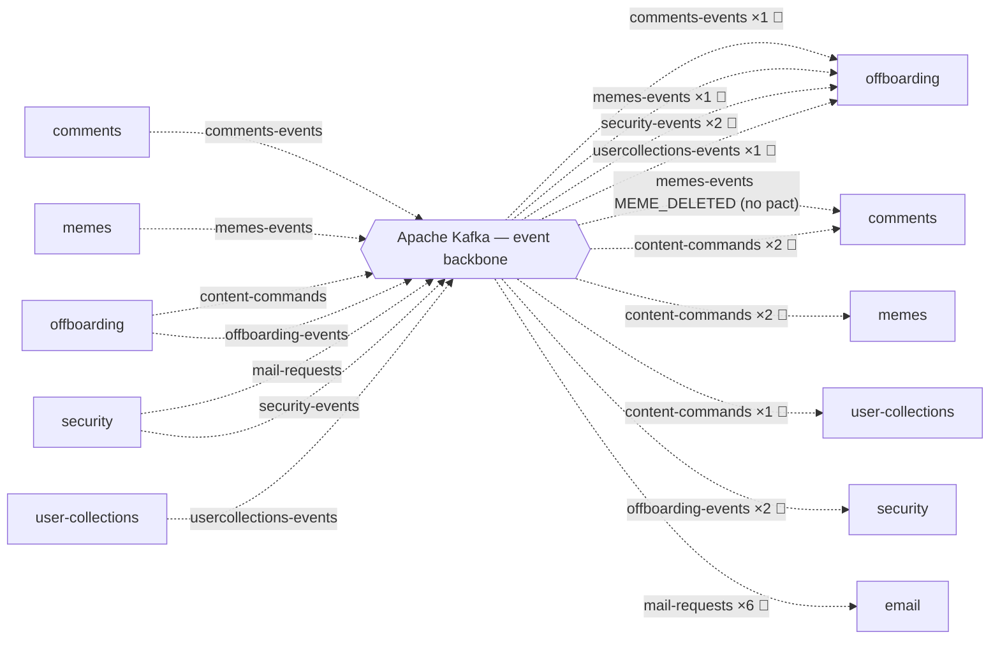

# Architecture — C4 diagrams (generated)

> **DO NOT EDIT BY HAND.** Generated by `./build_c4.py` from two sources of truth:
> `docker-compose.yml` (the runtime topology: HTTP edges, datastores, who sits on Kafka)
> and the committed pacts `*/pacts*/*.json` (event direction and semantics, HTTP contracts).
> Stack changed → run `python3 build_c4.py` and the diagrams catch up on their own.

## C1 — system context

**Two products, not one** (the owner's verdict, 2026-07-11): the social portal and the F1 game are separate beings. They share ONLY IDENTITY (one account + MFA) and this dev compose; the game has not a single edge to memes/comments/Kafka, and in production it ships separately (hosting/ per league).

## C2 — containers: synchronous edges (HTTP) and datastores

Service→service edges are derived from the environment variables in `docker-compose.yml`;
the label = the intent of the call. **The product boundary is a generator invariant**: the
only edges leaving the GAME lead to the shared identity — should a game↔portal edge ever
appear, `build_c4.py` aborts with an error instead of drawing it. Observability
(Prometheus/Grafana/Loki/Promtail/Tempo) is deliberately collapsed — it sees every
container and would be spaghetti on the diagram.

Notes not derivable from env vars (curated in the script): the browser edges — the UIs
bake their API URLs at build time; `race-sim` has no host port (only formula talks to it);
collections-ui calls security and user-collections **cross-origin** (CORS).
The notification channels (email/sms/push) live on the portal side; identity reaches them
across the boundary (MFA codes, account mail) — see ADR 0005.

## C2 — containers: the event backbone (Kafka)

Flow directions come from the **message pacts** (producer = the pact's provider) — which
`docker-compose.yml` cannot know (env only says "sits on Kafka"). 📜 = an edge pinned by
a contract, ×N = the number of message shapes in the pact.

(A service can stand on both sides of the backbone — offboarding consumes the fact and
the confirmations while producing the commands and the verdicts — hence it appears on
the left and on the right.)

Sitting on Kafka (env `KAFKA_BOOTSTRAP_SERVERS`): comments, email, memes, offboarding, security, user-collections. **The F1 game has not
a single edge here** — the event backbone belongs to the portal and identity (separate
products; the generator enforces this hard).

## Contract coverage (Pact)

| Consumer | Producer/Provider | Kind | Interactions | Pact file |
|---|---|---|---|---|
| comments | offboarding | message | a purge user content command; a purge user content command with an explicit policy | `microservice-comments/pacts/microservice-comments-microservice-offboarding.json` |
| email | security | message | a password reset mail request; a verification mail request; an account deleted mail request; an account deletion failed mail request; an already-registered notice mail request; an auth code mail request | `microservice-email/pacts/microservice-email-microservice-security.json` |
| memes | security | http | GET /me (×2) | `microservice-memes/pacts-http/microservice-memes-microservice-security.json` |
| memes | offboarding | message | a purge user content command; a purge user content command with an explicit policy | `microservice-memes/pacts/microservice-memes-microservice-offboarding.json` |
| offboarding | comments | message | a user content purged confirmation | `microservice-offboarding/pacts/microservice-offboarding-microservice-comments.json` |
| offboarding | memes | message | a user content purged confirmation | `microservice-offboarding/pacts/microservice-offboarding-microservice-memes.json` |
| offboarding | security | message | an account deletion requested fact; an account deletion requested fact with policy choices | `microservice-offboarding/pacts/microservice-offboarding-microservice-security.json` |
| offboarding | user-collections | message | a user content purged confirmation | `microservice-offboarding/pacts/microservice-offboarding-microservice-user-collections.json` |
| security | offboarding | message | a portal content purged announcement; a portal purge failed announcement | `microservice-security/pacts/microservice-security-microservice-offboarding.json` |
| user-collections | offboarding | message | a purge user content command | `microservice-user-collections/pacts/microservice-user-collections-microservice-offboarding.json` |
| offline-jwt | security | http | GET /.well-known/jwks.json | `offline-jwt/pacts/offline-jwt-microservice-security.json` |

Gaps visible from this table (as of generation): paddock (the email/sms/push fan-out),
formula↔race-sim and memes→image-encoder have no pacts — those diagram edges then come
from compose alone; the `MEME_DELETED` cascade is marked "no pact".

---
*Generated by `build_c4.py`. C1 and the "curated" entries live in the script —*
*change them there, not here.*
